# Projektdokumentation - StudySprint

## Inhaltsverzeichnis

1. [Ausgangslage](#1-ausgangslage)
2. [Lösungsidee](#2-lösungsidee)
    1. [Mindestumfang vs. Erweiterungen](#21-mindestumfang-vs-erweiterungen)
3. [Vorgehen & Artefakte](#3-vorgehen--artefakte)
    1. [Understand & Define](#31-understand--define)
    2. [Sketch](#32-sketch)
    3. [Decide](#33-decide)
    4. [Prototype](#34-prototype)
    5. [Validate](#35-validate)
4. [Erweiterungen](#4-erweiterungen-optional)
5. [Projektorganisation](#5-projektorganisation-optional)
6. [KI-Deklaration](#6-ki-deklaration)
7. [Anhang](#7-anhang-optional)


## 1. Ausgangslage

Im Studienalltag haben viele Studierende Mühe, ihre Lernzeit realistisch zu planen und konzentriert zu arbeiten. Häufig werden Lernaufgaben zwar vorgenommen, aber nicht klar priorisiert, zu spät begonnen oder durch Ablenkungen unterbrochen. Dadurch entstehen Stress, Zeitdruck und das Gefühl, trotz hohem Aufwand nicht produktiv genug zu sein. Besonders vor Prüfungen oder bei mehreren parallelen Abgaben fehlt oft eine einfache, motivierende und strukturierte Unterstützung für Planung, Fokus und Reflexion.

Viele bestehende Tools decken nur Teilaspekte ab. Kalender-Apps helfen bei der Terminplanung, To-do-Apps beim Erfassen von Aufgaben und Timer-Apps beim Fokussieren. Was oft fehlt, ist eine integrierte Lösung, die speziell auf den Lernalltag von Studierenden ausgerichtet ist und die wichtigsten Schritte in einem konsistenten Workflow verbindet: Lernziel festlegen, Session planen, fokussiert arbeiten, Fortschritt festhalten und daraus lernen.

- **Problem:** Studierende haben häufig Schwierigkeiten, ihre Lernzeit realistisch einzuschätzen, Lernaufgaben sinnvoll zu priorisieren, konzentrierte Lernphasen ohne Ablenkung durchzuführen, ihren Fortschritt sichtbar zu machen und aus vergangenen Lernsessions Verbesserungen abzuleiten. Dies führt zu ineffizientem Lernen, höherem Stresslevel und geringerer Zufriedenheit mit dem eigenen Lernverhalten.
- **Ziele:** Mit **StudySprint** soll ein digitaler Prototyp entstehen, der Studierende dabei unterstützt, Lernziele klar zu formulieren, Lernsessions einfach zu planen, fokussiert zu arbeiten, Lernfortschritt sichtbar zu machen und nach einer Session kurz zu reflektieren. Das angestrebte Ergebnis ist eine benutzerfreundliche, interaktive App mit klarem Workflow.
- **Primäre Zielgruppe:** Studierende an Hochschulen, die mehrere Module gleichzeitig organisieren müssen, unter Zeitdruck stehen und ihre Lernphasen strukturierter gestalten möchten.
- **Weitere Stakeholder [Optional]:** _[keine weiteren Stakeholder im Mindestumfang definiert]_


## 2. Lösungsidee

**StudySprint** ist eine Lernplan- und Fokus-App für Studierende. Die App verbindet Aufgabenplanung, Lernsessions, Fokusmodus und Reflexion in einem zusammenhängenden Prozess. Nutzer:innen sollen nicht nur To-dos erfassen, sondern ihren Lernalltag aktiv strukturieren und verbessern können.

Der zentrale Lernworkflow lautet: **Planung → Fokus → Fortschritt → Reflexion**

- **Kernfunktionalität:** Lernaufgaben anlegen und verwalten, eine Fokus-Session mit Timer starten, Fortschritt erfassen, eine kurze Reflexion festhalten und eine Übersicht über offene Aufgaben sowie absolvierte Sessions anzeigen.
- **Annahmen [Optional]:** Die wichtigste Hypothese ist, dass ein integrierter Workflow (Planung + Fokus + Reflexion in einer App) mehr Mehrwert bietet als einzelne Speziallösungen. Weitere Annahme: Studierende sind bereit, kurze Reflexionen nach Sessions einzutragen, wenn der Aufwand minimal ist.
- **Abgrenzung [Optional]:** Nicht Teil des Mindestumfangs sind Integrationen mit externen Kalendern, Push-Benachrichtigungen oder kollaborative Lernfunktionen.

### 2.1 Mindestumfang vs. Erweiterungen

Der **Mindestumfang** entspricht dem Kern aus den Übungen (ab Semesterwoche 8): ein integrierter Lernworkflow mit erfassbaren und bearbeitbaren Daten. **Erweiterungen** (Kap. 4) gehen darüber hinaus und sind für die Bewertungsteil B separat begründet.

| Bereich | Mindestumfang (Pflicht) | Erweiterung (optional, Kap. 4) |
| --- | --- | --- |
| **Workflow** | Planung → Fokus → Fortschritt → Reflexion in einer App | OCR-/Text-Deadline-Import, Import-Review |
| **Aufgaben** | Anlegen, bearbeiten, löschen; Status; Priorität; Modul; Deadline; geschätzte Dauer | Semester/Modul-Verwaltung in MongoDB, Notizen, Modulfarben |
| **Fokus** | Aufgabe wählen, Countdown-Timer, Pause/Reset, Reflexion danach | Timer-Persistenz bei Tab-Wechsel (Bugfix aus Evaluation) |
| **Fortschritt** | Übersicht erledigter Aufgaben, Fokuszeit, Soll/Ist-Vergleich | Wochenchart, Zeitraumfilter (Woche/Monat/Semester), Modul-Aufschlüsselung |
| **Oberfläche** | Mobile-first, 5 Tabs (Home, Aufgaben, Fokus, Fortschritt, Profil), Figma-Mockup | Dark Mode, konsolidierte Feature-Architektur |
| **Technik** | SvelteKit, persistente Daten (MongoDB), Online-Deployment | Per-User-Auth (E-Mail/Passwort, Session), Gemini OCR |
| **Nicht enthalten** | Externe Kalender, Push, Kollaboration | — |

## 3. Vorgehen & Artefakte

Die Durchführung erfolgt phasenbasiert; dokumentieren Sie die wichtigsten Ergebnisse je Phase.

### 3.1 Understand & Define

- **Zielgruppenverständnis:** Der Problemraum liegt in den Bereichen Bildung, Digitalisierung und Produktivität im Alltag. Typische Nutzer:innen sind Bachelor- oder Masterstudierende mit mehreren parallelen Modulen, engem Zeitbudget und dem Wunsch nach besserer Selbstorganisation.
- **Wesentliche Erkenntnisse:**
  - Viele Studierende nutzen heute mehrere getrennte Tools für Planung, Fokus und Reflexion.
  - Das Kernproblem ist nicht nur fehlende Planung, sondern die fehlende Verbindung zwischen Planung, Durchführung und Reflexion.
  - Bestehende Productivity-Tools sind oft zu generisch oder zu komplex.
  - Ein reduzierter, studierendengerechter MVP bietet mehr Mehrwert als eine überladene Lösung.
  - **How-Might-We-Fragen:** Wie könnten wir Studierenden helfen, ihre Lernzeit realistischer zu planen? Wie könnten wir Ablenkung während Lernphasen reduzieren? Wie könnten wir Lernfortschritte sichtbar machen, damit Motivation und Selbstorganisation steigen?

#### Persona: Primäre Zielgruppe

> Methode: Proto-Persona, hergeleitet aus Zielgruppenanalyse und eigener Erfahrung als Studierender. Ziel ist die Konkretisierung der Zielgruppe für fundierte Design- und Funktionsentscheide.

| Attribut | Beschreibung |
|---|---|
| **Name** | Jonas Meier |
| **Alter** | 22 Jahre |
| **Studium** | Bachelor Wirtschaftsinformatik, 4. Semester, ZHAW |
| **Wohnsituation** | WG, arbeitet 40% nebenbei |
| **Geräte** | MacBook (primär), iPhone (unterwegs) |
| **Tech-Affinität** | Hoch – nutzt täglich digitale Tools, aber keine komplexen Setups |

**Ziele:**
- Prüfungen ohne Nachtschichten bestehen – durch bessere Vorausplanung
- Lernzeit realistisch einschätzen und nicht unterschätzen
- Das Gefühl haben, produktiv zu sein – nicht nur beschäftigt

**Frustrationen & Pain Points:**
- Nutzt Notion für Aufgaben, Apple Reminders für Deadlines und einen Pomodoro-Timer separat – drei Apps, kein durchgängiger Workflow
- Verliert regelmässig den Überblick bei parallelen Abgaben in 5+ Modulen
- Beginnt Lernblöcke oft ohne klares Ziel und weiss danach nicht, was er eigentlich erledigt hat
- Schätzt Bearbeitungszeiten systematisch zu niedrig ein

**Zitate (repräsentativ):**
> «Ich weiss, was ich tun muss – aber ich weiss nie, womit ich anfangen soll.»
> «Nach einer Lernstunde bin ich oft nicht sicher, ob ich produktiv war oder nur beschäftigt.»

**Nutzungskontext:**
- Abends zuhause (1–3 Std. Lernblöcke)
- Kurze Sessions zwischen Vorlesungen (15–30 Min.)
- Prüfungsphase: intensive Planungs- und Fokusphasen über mehrere Wochen

### 3.2 Sketch

- **Variantenüberblick:** Es wurden drei grobe Lösungsrichtungen identifiziert. Die handgezeichneten Skizzen sind im Anhang verfügbar: [StudySprint_Sketch.pdf](./StudySprint_Sketch.pdf)
- **Skizzen:**
  - **Variante A: Fokus auf Planung** – Aufgabenverwaltung und Session-Planung stehen im Zentrum. Einfache To-do-Liste mit Zeitschätzungen.
  - **Variante B: Fokus auf Fokusmodus** – Timer und konzentriertes Arbeiten stehen im Zentrum. Pomodoro-ähnliche Struktur ohne Aufgabenverwaltung.
  - **Variante C: Integrierter Lernworkflow** – Planung, Fokusmodus, Fortschritt und Reflexion werden in einem durchgehenden Ablauf kombiniert. Komplexer, aber vollständiger Ansatz.

  | Crazy 8s – Variantenskizzen | Happy Path – Gewählter Ablauf |
  |---|---|
  | 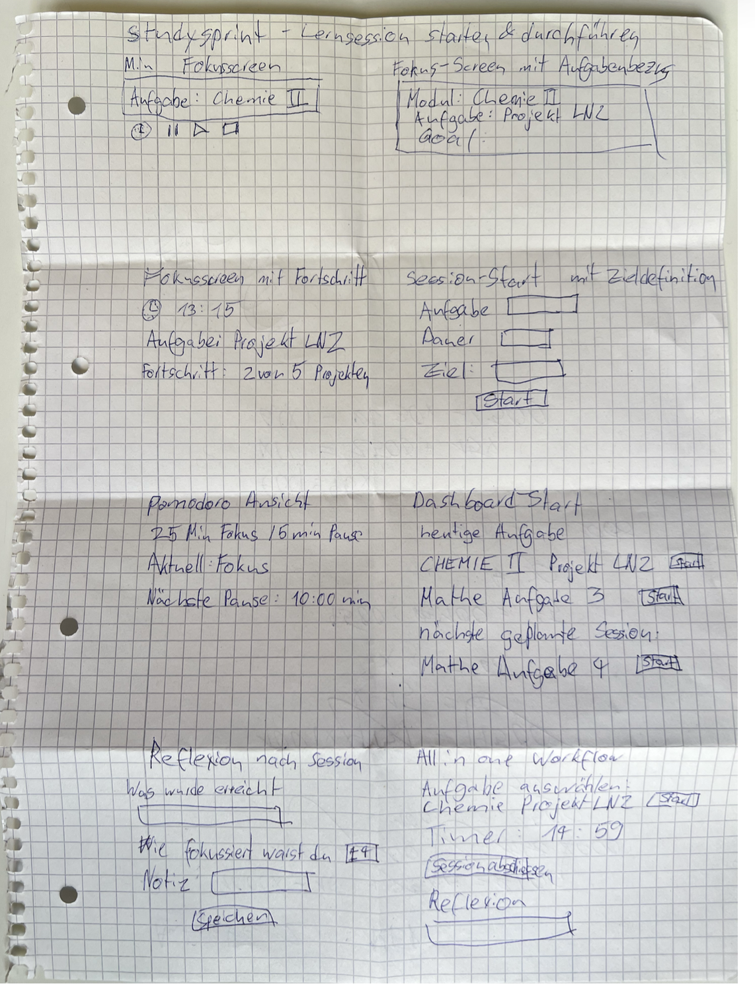 | 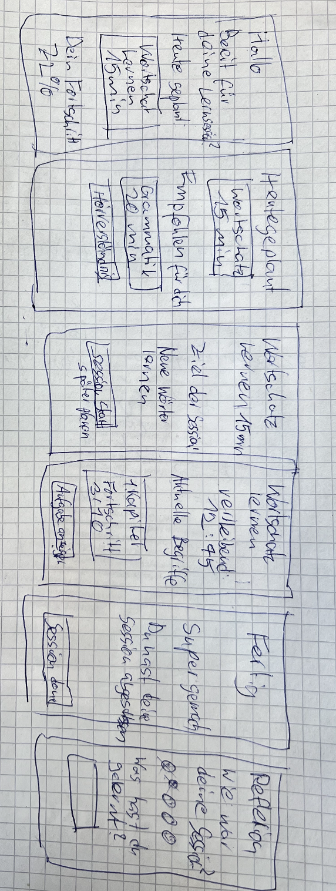 |
  | 8 Varianten des Fokus-Screens: minimale Ansicht, Aufgabenbezug, Fortschrittsanzeige, Session-Start mit Zieldefinition, Pomodoro, Dashboard-Start, Reflexion und All-in-One-Workflow. | Vollständiger Ablauf von der Planung («Heute geplant») über Fokusmodus und Fortschrittskontrolle bis zur Reflexion – dient als Grundlage für Variante C. |

### 3.3 Decide

- **Gewählte Variante & Begründung:** **Variante C – Integrierter Lernworkflow**, da sie das Kernproblem am vollständigsten adressiert, mehrere klare Workflows ermöglicht und sich gut für einen interaktiven Prototyp mit Datenverarbeitung eignet. Entscheidkriterien: Problemabdeckung, Interaktionstiefe, technische Umsetzbarkeit.
- **End-to-End-Ablauf:** Nutzer:in öffnet das Dashboard, legt eine Aufgabe an, startet eine Fokus-Session mit Timer, trägt anschliessend Fortschritt ein, ergänzt eine kurze Reflexion und sieht die aktualisierte Übersicht.
- **Mockup:** [Figma-Prototyp (Übung 10)](https://www.figma.com/proto/RmKMdEYCp6l5oIJJj5h3HG/StudySprint---Uebung-10-Prototyp?node-id=16-494&t=slL3OtXg9dkGPyHz-1)

  | Onboarding / Start | Dashboard (Home) | Aufgabe erstellen |
  |---|---|---|
  | 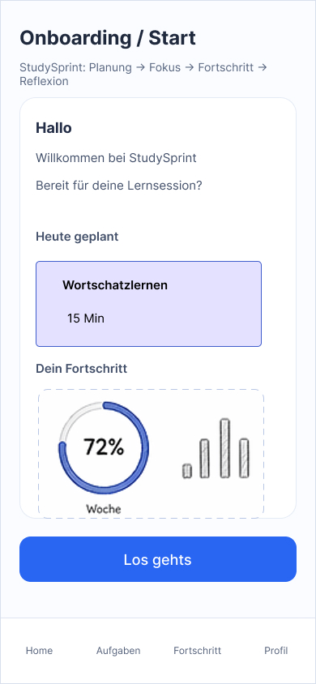 | 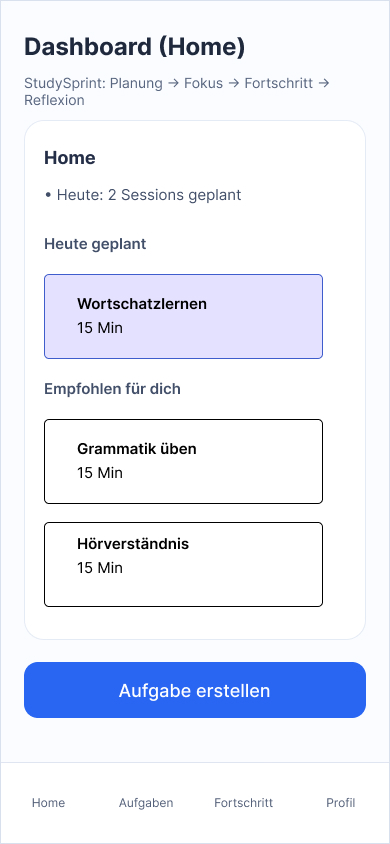 | 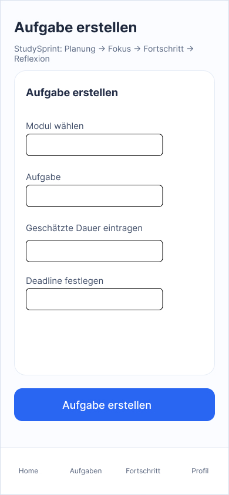 |
  | Einstieg mit heutigem Plan und Empfehlung für die nächste Session. | Startseite mit Tagesübersicht, empfohlenen Aufgaben und Bottom-Navigation. | Formular zum Erfassen einer neuen Lernaufgabe mit Modul, Titel, Dauer und Deadline. |

  | Aufgabenliste | Planungsansicht | Fortschritt |
  |---|---|---|
  | 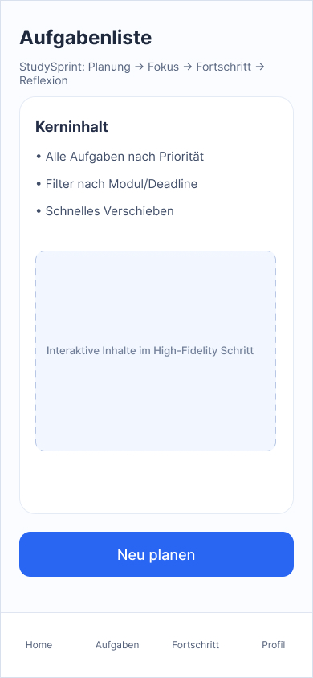 | 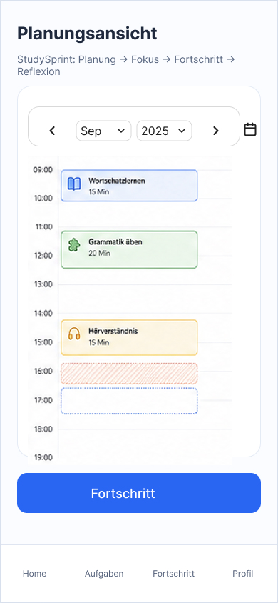 | 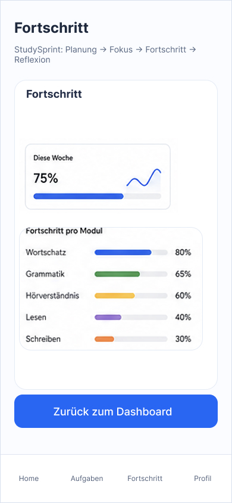 |
  | Listenansicht aller Aufgaben nach Priorität mit Modul- und Deadline-Filter. | Kalenderbasierte Planungsansicht für die Semesterstruktur. | Fortschritts-Tab mit Kennzahlen zu abgeschlossenen Aufgaben und Fokuszeit. |

#### User Journey Map

> Methode: User Journey Map für den zentralen Workflow «Planung → Fokus → Reflexion → Fortschritt». Grundlage sind die Persona Jonas Meier und die Erkenntnisse aus der Usability Evaluation (v1). Ziel: Pain Points im Ablauf identifizieren und als Designanforderungen ableiten.

| | **1. Planung** | **2. Aufgabe erfassen** | **3. Fokus starten** | **4. Fokussiert arbeiten** | **5. Session abschliessen** | **6. Reflexion** | **7. Fortschritt prüfen** |
|---|---|---|---|---|---|---|---|
| **Aktion** | App öffnen, Home-Tab anschauen | Aufgaben-Tab öffnen, neue Aufgabe anlegen | Fokus-Tab öffnen, Aufgabe wählen, Timer starten | Timer läuft, konzentriert arbeiten | Timer ablaufen lassen oder manuell beenden | Bewertung (1–5) und Notiz eingeben | Fortschritts-Tab öffnen, Wochenübersicht anschauen |
| **Gedanken** | «Was muss ich heute noch erledigen?» | «Wie lange wird das wohl dauern?» | «Ok, jetzt starte ich – kein Ablenkung.» | «Hoffentlich halte ich die Zeit ein.» | «War das jetzt effizient?» | «Kurz notieren, was gut lief.» | «Wie viel habe ich diese Woche geschafft?» |
| **Gefühl** | 😐 Orientierungssuche | 🙂 Struktur entsteht | 🎯 Fokus und Entschlossenheit | 😤 Konzentration, gelegentlich Ablenkung | 😌 Erleichterung | 🤔 Nachdenklich | 😊 Zufriedenheit / Motivation |
| **Pain Points (v1)** | Kein Dashboard-Überblick; Quick Actions ohne Mehrwert | Scrollen bis zur Aufgabenliste; kein Modul-Dropdown | «Session»-Begriff verwirrend; Aufgabe unklar auswählbar | Timer stoppt bei Tab-Wechsel / App-Hintergrund | Unklar wie Session korrekt beendet wird | Reflexion nach Session nicht sichtbar in Fortschritt | Kein Wochenchart; Sessions-Zähler widersprüchlich |
| **Verbesserung (v2)** | Home zeigt Metriken, nächste Deadline, Aufgaben der Woche | Aufgabenliste im Vordergrund; Subviews für Import/Neu | «Session»-Begriff entfernt; klare Aufgaben-Auswahl | Timer läuft bei Tab-Wechsel weiter ([Issue #1](https://github.com/BuckyMain/StudySprint/issues/1), geschlossen) | Klarer Abschluss-Button; Status wird automatisch gesetzt | Reflexions-Rating und Notiz in Fortschritt sichtbar | Wochenchart, Modul-Aufschlüsselung, Zeitraum-Wechsel |

### 3.4 Prototype

#### 3.4.1. Entwurf (Design)

Beschreibt die Gestaltung und Interaktion.

> **Hinweis:** Hier wird der **Prototyp** beschrieben, nicht das **Mockup**.

- **Informationsarchitektur:** Hauptseiten sind Dashboard (mit Tabs: Home, Aufgaben, Fokus, Fortschritt, Profil), Aufgaben-Übersicht, Aufgabe erstellen/bearbeiten, Fokusmodus und Reflexion. Navigation erfolgt primär über eine Bottom-Tab-Leiste (Mobile-first).
- **User Interface Design:** Die App ist mobile-first gestaltet und läuft im Browser. Alle fünf Tabs sind nachfolgend abgebildet.

  | Home-Tab | Aufgaben-Tab | Fokus-Tab |
  |---|---|---|
  | 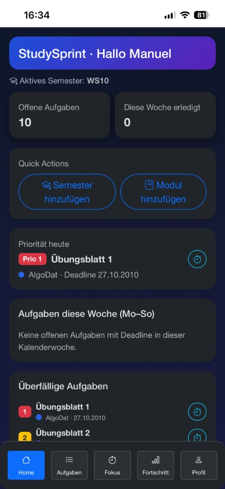 | 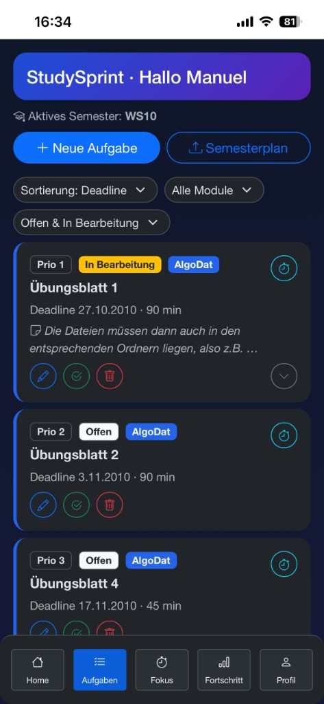 | 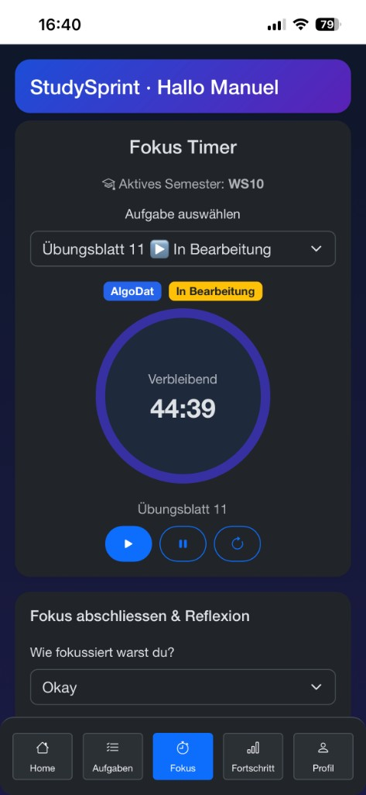 |
  | Übersicht mit Metriken, höchstpriorer Aufgabe, Aufgaben der Woche und überfälligen Aufgaben. | Aufgabenliste mit Sortierung (Deadline, Priorität), Modulfilter, Statusfilter und Direktzugriff auf Fokus-Timer. | Countdown-Timer mit Aufgabenauswahl, Pause/Reset und integrierter Reflexionseingabe nach Abschluss. |

  | Fortschritt-Tab | Profil-Tab |
  |---|---|
  | 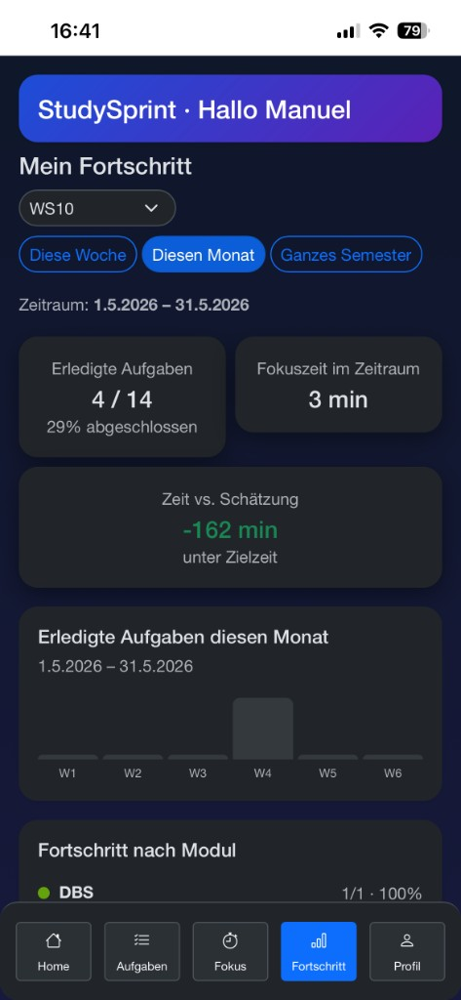 | 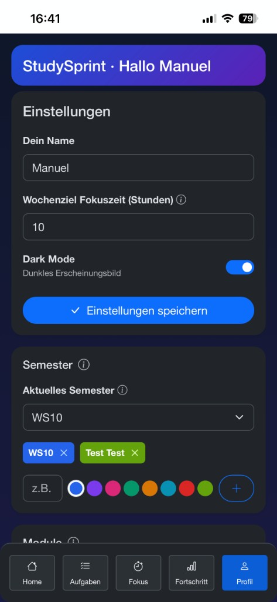 |
  | Lernfortschritt mit Kennzahlen (erledigte Aufgaben, Fokuszeit, Zeit vs. Schätzung), Wochenchart und Fortschritt nach Modul. | Einstellungen (Name, Wochenziel, Dark Mode), Semesterverwaltung mit Farbzuweisung und Modulverwaltung. |
- **Designentscheidungen:**
  - Mobile-first mit Bottom-Navigation (Tab-Leiste).
  - Reduzierte, ruhige Oberfläche mit wenig Ablenkung.
  - Fokusmodus visuell klar abgesetzt (grosser Timer, eine aktive Aufgabe).
  - Sichtbarer Fortschritt als Motivationselement.
  - Reflexion als kurze Mikro-Interaktion nach einer Session.

#### 3.4.2. Umsetzung (Technik)

Fasst die technische Realisierung zusammen.

- **Technologie-Stack:**

  | Technologie | Verwendung |
  |---|---|
  | SvelteKit (Svelte 5 Runes) | Frontend-Framework, Routing, API-Handler |
  | Bootstrap 5 + Bootstrap Icons | UI-Styling und Icons |
  | MongoDB (via `mongodb` Node-Driver) | Persistenz (Tasks, Reflections, Semester, Module, Settings) |
  | Google Gemini API (`@google/genai`) | OCR-Erkennung für Deadline-Extraktion |
  | `@sveltejs/adapter-auto` | Deployment-Adapter |

- **Tooling:** VS Code / Cursor IDE mit Svelte-Extension; MongoDB Atlas (Cloud-Datenbank); Netlify/Vercel für Deployment. KI-Einsatz siehe Kapitel **KI-Deklaration**.

- **Struktur & Komponenten:**

  | Komponente | Beschreibung |
  |---|---|
  | `src/lib/features/tabs/HomeTab.svelte` | Home-Tab mit Übersicht, Metriken, nächster Deadline und Aufgaben der Woche |
  | `src/lib/features/tabs/TasksTab.svelte` | Aufgaben-Tab mit Listen-, Formular- und Import-Subview |
  | `src/lib/features/tabs/FocusTab.svelte` | Fokus-Tab mit Countdown-Timer, Aufgabenauswahl, Pause/Reset und Reflexionseingabe |
  | `src/lib/features/tabs/ProgressTab.svelte` | Fortschritts-Tab mit Kennzahlen, Charts und Detailansichten |
  | `src/lib/features/tabs/ProfileTab.svelte` | Profil-Tab für Settings, Semester/Modul-Verwaltung und Reset |

  Implementierte Seiten/Routen:

  | Route | Beschreibung |
  |---|---|
  | `/` | Dashboard mit Tab-Navigation (Home, Aufgaben, Fokus, Fortschritt, Profil) |

- **Nutzerflow – Anmeldung (Einstieg):** Beim ersten Öffnen der App erscheint ein Login-/Registrierungsformular. Ohne gültige Session sind die Tabs nicht erreichbar; alle Daten sind pro Benutzerkonto getrennt.

  1. **Registrieren** oder **Anmelden** mit E-Mail und Passwort (mindestens 8 Zeichen) → Session-Cookie (`studysprint_session`).
  2. **Profil** einrichten: Name, optional Wochenziel, Semester und Module anlegen (für Aufgaben und Fortschritt).
  3. **Aufgaben** erfassen oder importieren → **Fokus** starten → **Reflexion** speichern → **Fortschritt** prüfen; **Home** als Übersicht.
  4. **Abmelden** im Profil-Tab (Session wird serverseitig beendet).

  > Im kommentierten Video-Walkthrough wird der Einstieg mit Anmeldung gezeigt, bevor die Tab-Funktionen demonstriert werden.

- **Daten & Schnittstellen:** Daten werden in MongoDB Atlas gespeichert und über REST-API-Endpunkte verwaltet. Das Datenmodell für Tasks:

  ```json
  {
    "userId": "String (Pflicht, aus Session)",
    "title": "String (Pflicht)",
    "module": "String (Pflicht)",
    "priority": "String ('1'–'5', Standard: '3')",
    "status": "String ('offen' | 'in Bearbeitung' | 'erledigt')",
    "dueDate": "Date (optional)",
    "duration": "Number (Minuten, Standard: 25)",
    "semesterId": "String (optional)",
    "moduleId": "String (optional)",
    "notes": "String (optional)",
    "createdAt": "Date",
    "updatedAt": "Date"
  }
  ```

  API-Endpunkte:

  | Endpunkt | Methoden | Funktion |
  |---|---|---|
  | `/api/auth/register` | POST | Benutzerkonto erstellen (E-Mail/Passwort) und Session setzen |
  | `/api/auth/login` | POST | Anmelden und Session setzen |
  | `/api/auth/logout` | POST | Session beenden |
  | `/api/auth/me` | GET | Aktuell angemeldeten Benutzer laden |
  | `/api/tasks` | GET, POST | Alle Aufgaben abrufen / neue Aufgabe erstellen |
  | `/api/tasks/[id]` | GET, PATCH, DELETE | Einzelne Aufgabe lesen, aktualisieren, löschen |
  | `/api/reflections` | GET, POST | Reflexionen abrufen / erstellen |
  | `/api/semesters` | GET, POST | Semester abrufen / erstellen |
  | `/api/semesters/[id]` | PATCH, DELETE | Semester aktualisieren / löschen |
  | `/api/modules` | GET, POST | Module abrufen / erstellen |
  | `/api/modules/[id]` | PATCH, DELETE | Modul aktualisieren / löschen |
  | `/api/settings` | GET, PUT | Benutzereinstellungen laden / speichern |
  | `/api/data/reset` | DELETE | Nur Daten des aktuellen Benutzers löschen |
  | `/api/deadlines/extract` | POST | Deadlines per Regex aus Text extrahieren |
  | `/api/deadlines/ocr` | POST | Deadlines aus Bild per Google Gemini extrahieren |

- **Deployment:** [https://studysprintver2.netlify.app/](https://studysprintver2.netlify.app/) – Platform: Netlify (via `@sveltejs/adapter-auto`). Benötigte Umgebungsvariablen: `MONGODB_URI`, `MONGODB_DB_NAME`, `GEMINI_API_KEY`, `AUTH_SESSION_SECRET`. Für Legacy-Datenmigration zusätzlich einmalig: `AUTH_BOOTSTRAP_EMAIL`, `AUTH_BOOTSTRAP_PASSWORD`.

  Lokale Entwicklung:

  ```sh
  npm install
  # .env-Datei erstellen mit MONGODB_URI, MONGODB_DB_NAME, GEMINI_API_KEY, AUTH_SESSION_SECRET
  # optional fuer Legacy-Migration: AUTH_BOOTSTRAP_EMAIL, AUTH_BOOTSTRAP_PASSWORD
  npm run dev
  ```

  Optionaler Isolationstest (setzt laufende App voraus):

  ```sh
  npm run test:isolation
  ```

- **Besondere Entscheidungen:** MongoDB wurde gegenüber einer SQL-Datenbank bevorzugt, da das Datenmodell flexibel und schemalos entwickelt werden sollte. Der Fokus lag auf einem konsistenten Task/Reflexions-Flow mit semester- und modulbezogener Struktur. OCR-Deadline-Erkennung wurde als optionale Erweiterung über die Gemini API integriert, da eine lokale OCR-Lösung zu aufwändig gewesen wäre.

### 3.5 Validate

- **URL der getesteten Version:** [https://studysprintv1.netlify.app/](https://studysprintv1.netlify.app/)
- **Ziele der Prüfung:** Überprüfen, ob Nutzer:innen den zentralen Lernworkflow (Planung → Fokus → Fortschritt → Reflexion) intuitiv verstehen, Aufgaben selbstständig erstellen und verwalten können und ob Fortschritt sowie Deadline-Import verständlich sind.
- **Vorgehen:** Moderierte On-site-Evaluation (Kleinklasse). Testpersonen erhielten schriftliche Aufgaben auf separatem Gerät und wurden gebeten, laut zu denken. Testleiter:in notierte Beobachtungen im Feedback Grid ohne Hinweise zu geben. Abschliessend kurzes Interview.
- **Stichprobe:** 2 Mitstudierende (ZHAW), keine Vorerfahrung mit StudySprint; Datum: 20.05.2026
- **Aufgaben/Szenarien:**
  1. Lernaufgabe für ein Modul anlegen (Einstieg).
  2. Aufgabe bearbeiten und als hochprioritär markieren.
  3. Fokus-Session starten und abschliessen.
  4. Reflexion nach der Session erfassen.
  5. Lernfortschritt und absolvierte Sessions nachvollziehen.
- **Kennzahlen & Beobachtungen:** 16 Usability-Issues identifiziert; 4 mit Schweregrad 3–4 (kritisch). Detaillierte Issue Map in [`EVALUATION.md`](./EVALUATION.md).
- **Zusammenfassung der Resultate:** Der Gesamtworkflow ist grundsätzlich verständlich; die Startseite verschafft einen guten Überblick. Positiv hervorgehoben wurden der Fortschritts-Tab und der Semesterplan-Import. Kritische Probleme: fehlende Import-Review (Tasks konnten nicht einzeln geprüft/übernommen werden), inkonsistente Navigation, und der Begriff «Session» schuf konzeptuelle Verwirrung. Die OCR-Funktion lieferte unzuverlässige Ergebnisse.
- **Abgeleitete Verbesserungen:** Menüpunkt «Validate» entfernt, Import-Review implementiert, Navigation vereinheitlicht, Aufgabenliste in den Vordergrund gestellt, Sortierung/Filterung ergänzt, Fortschritts-Tab mit Detailinfos ausgebaut. Vollständige Verbesserungsliste in `EVALUATION.md §3.4`.

## 4. Erweiterungen

Dokumentiert Funktionen und Qualitätssprünge **über** den in [§2.1](#21-mindestumfang-vs-erweiterungen) definierten Mindestumfang hinaus. Kernworkflow-Features (Aufgaben, Fokus-Timer, Reflexion, Fortschritt, Filter/Sortierung) gehören zum Mindestumfang und sind hier nicht nochmals aufgeführt.

> **Hinweis:** Jede Erweiterung ist separat nach dem folgenden Schema beschrieben.

### 4.1 OCR-Deadline-Erkennung
- **Beschreibung & Nutzen:** Bilder (z. B. Stundenplan-Screenshots) können hochgeladen werden. Google Gemini extrahiert automatisch Deadlines aus dem Bild. Spart manuelles Abtippen und reduziert Fehler.
- **Wo umgesetzt:**
  - **Frontend:** Datei-Upload im Dashboard-Tab «Home»
  - **Backend:** API-Endpunkt `/api/deadlines/ocr` in `src/routes/api/deadlines/ocr/+server.js`
- **Referenz:** Technologie-Stack-Tabelle in Kap. 3.4.2
- **Aus Evaluation abgeleitet?:** Nein, von Beginn an geplant.

### 4.2 Text-basierte Deadline-Extraktion
- **Beschreibung & Nutzen:** Freitext kann eingegeben werden; ein Regex-Algorithmus erkennt Daten und Modulnamen automatisch. Ermöglicht schnellen Import ohne manuelle Eingabe.
- **Wo umgesetzt:**
  - **Frontend:** Texteingabe-Feld im Dashboard-Tab «Home»
  - **Backend:** API-Endpunkt `/api/deadlines/extract` in `src/routes/api/deadlines/extract/+server.js`
- **Referenz:** API-Endpunkte-Tabelle in Kap. 3.4.2
- **Aus Evaluation abgeleitet?:** Nein, von Beginn an als Ergänzung zur OCR-Variante geplant.

### 4.3 Import-Review (selektive Übernahme)
- **Beschreibung & Nutzen:** Nach Text- oder OCR-Import können erkannte Deadlines einzeln geprüft, bearbeitet und gezielt übernommen werden – statt «alles oder nichts».
- **Wo umgesetzt:**
  - **Frontend:** Review-Liste im Aufgaben-Tab, Subview «Semesterplan» (`TasksTab.svelte`, `task-import-actions.js`)
- **Referenz:** Evaluation I-13 in [`EVALUATION.md`](./EVALUATION.md)
- **Aus Evaluation abgeleitet?:** Ja (Usability Evaluation v1).

### 4.4 Per-User-Authentifizierung
- **Beschreibung & Nutzen:** E-Mail/Passwort-Login mit serverseitiger Session; Tasks, Reflexionen, Semester und Einstellungen sind pro `userId` isoliert. Ermöglicht sicheren Mehrbenutzer-Betrieb im Deployment und einen benutzerspezifischen Reset.
- **Wo umgesetzt:**
  - **Frontend:** Login/Registrierung und Abmelden in `src/routes/+page.svelte`, Profil-Tab
  - **Backend:** `/api/auth/*` in `src/routes/api/auth/`, Session-Logik in `src/lib/server/auth.js`
- **Referenz:** Nutzerflow in Kap. 3.4.2; Isolationstest `npm run test:isolation`
- **Aus Evaluation abgeleitet?:** Nein; technische Anforderung für produktionsnahes Deployment.

### 4.5 Semester- und Modul-Verwaltung (persistente Struktur)
- **Beschreibung & Nutzen:** Semester mit Farben und zugehörige Module werden in MongoDB verwaltet und für Aufgaben, Filter und Fortschrittsansichten genutzt.
- **Wo umgesetzt:**
  - **Frontend:** Profil-Tab (`ProfileTab.svelte`)
  - **Backend:** `/api/semesters`, `/api/modules`, `/api/settings`
- **Referenz:** Datenmodell und API-Tabelle in Kap. 3.4.2
- **Aus Evaluation abgeleitet?:** Teilweise (Profil-Bereich in v1 unvollständig, I-07).

### 4.6 Dark Mode & erweiterte Profil-Einstellungen
- **Beschreibung & Nutzen:** Umschaltbares helles/dunkles Theme, Wochenziel für Fokuszeit und Anzeigename – verbessert Nutzung in unterschiedlichen Lernkontexten.
- **Wo umgesetzt:**
  - **Frontend:** Profil-Tab, `data-bs-theme` via `$effect` in `+page.svelte`
  - **Backend:** `/api/settings` (PUT)
- **Referenz:** Screenshots Profil-Tab in Kap. 3.4.1
- **Aus Evaluation abgeleitet?:** Nein.

### 4.7 Konsolidierter Feature-Aufbau
- **Beschreibung & Nutzen:** Der Aufgaben-Flow wurde auf eine einzige Hauptroute (`/` mit Tab-Views) konsolidiert. Das reduziert doppelte UI-Logik und vereinfacht Wartung sowie Navigation.
- **Wo umgesetzt:**
  - **Frontend:** Tab-Komponenten unter `src/lib/features/tabs/` (`TasksTab`, `ProfileTab`, `ProgressTab`, `HomeTab`, `FocusTab`)
  - **Routing:** Der Aufgabenfluss ist vollständig im Dashboard (`/`) über den Aufgaben-Tab integriert.
- **Referenz:** Routen-Tabelle und Struktur-Abschnitt in Kap. 3.4.2
- **Aus Evaluation abgeleitet?:** Teilweise — zusätzlich aus technischem Refactoring zur Reduktion von Duplikaten.

## 5. Projektorganisation
- **Repository & Struktur:** [GitHub – StudySprint](https://github.com/BuckyMain/StudySprint). Struktur: `src/routes/` für Seiten und API-Handler, `src/lib/features/` für Tab-Komponenten und fachliche Actions.
- **Issue-Management:** Bugs und Verbesserungen werden als [GitHub Issues](https://github.com/BuckyMain/StudySprint/issues) erfasst, bearbeitet und geschlossen. Beispiele aus der Abgabephase:

  | Issue | Thema | Status |
  | --- | --- | --- |
  | [#1](https://github.com/BuckyMain/StudySprint/issues/1) | Timer stoppt beim Schliessen des Browser-Tabs / der App | geschlossen |
  | [#2](https://github.com/BuckyMain/StudySprint/issues/2) | Wochenchart bleibt grau bei «Diesen Monat» / «Ganzes Semester» | geschlossen |
  | [#3](https://github.com/BuckyMain/StudySprint/issues/3) | «Alle Daten löschen» schlägt im Deployment fehl | geschlossen |
  | [#4](https://github.com/BuckyMain/StudySprint/issues/4) | Deadline-Icon im Dark Mode beim Bearbeiten unsichtbar | geschlossen |

  Issue #1 ging auf einen Pain Point aus der Usability Evaluation (User Journey, Tab-Wechsel) zurück; behoben u. a. mit Wall-Clock-Sync und `localStorage`-Persistenz des Timers (Commit `672bdb1`).

- **Commit-Praxis:** Sprechende Commits mit Präfixen (`feat:`, `fix:`, `refactor:`, `docs:`). Entwicklung primär auf `main`, Feature-Branches bei grösseren Änderungen.

## 6. KI-Deklaration

Die folgende Deklaration ist verpflichtend und beschreibt den Einsatz von KI im Projekt.

### 6.1 KI-Tools

- **Eingesetzte Tools:**
  - **Claude Sonnet** (via Cursor IDE) – KI-gestützte Code-Generierung, Refactoring, Debugging und Dokumentation
  - **ChatGPT** – Ideenfindung, Strukturierung der Problemstellung und Formulierung der Dokumentation
  - **GitHub Copilot** – Unterstützende Code-Vorschläge beim Schreiben
  - **Google Gemini API** – Eingebunden als Produktfeature für die OCR-basierte Deadline-Erkennung
- **Zweck & Umfang:** Claude Sonnet wurde am intensivsten eingesetzt, primär für Codevorschläge, Komponentenstruktur, API-Implementierungen und Refactoring. ChatGPT wurde für Ideenfindung und Textformulierungen genutzt. Copilot lieferte kleinere Autovervollständigungen. Grössere Teile des Codes (insbesondere API-Handler und Svelte-Komponenten) entstanden mit KI-Unterstützung und wurden eigenständig überprüft, angepasst und integriert.
- **Eigene Leistung (Abgrenzung):** Die Auswahl des Projektthemas, die inhaltliche Ausrichtung, alle Architektur- und Designentscheidungen sowie die Überarbeitung und Integration der KI-Vorschläge erfolgten eigenständig. KI dient unterstützend, ersetzt aber nicht die eigene Analyse, Umsetzung und Verantwortung.

### 6.2 Prompt-Vorgehen

Beim Einsatz von KI wurde darauf geachtet, konkrete und kontextbezogene Anweisungen zu formulieren. Typische Vorgehensweise:

1. **Kontext** – Stack, betroffene Datei/Komponente, gewünschtes Verhalten
2. **Aufgabe** – eine klar abgegrenzte Änderung (kein «baue die ganze App»)
3. **Prüfung** – Vorschlag lesen, lokal testen, an Projektkonventionen anpassen, bei Bedarf nachprompten

Keine KI-Ausgabe wurde ungeprüft übernommen. Nachfolgend drei repräsentative Beispiel-Prompts (leicht gekürzt/paraphrasiert):

#### Beispiel 1 – Bugfix nach Evaluation (Cursor / Claude)

**Ziel:** Timer soll beim Tab-Wechsel und beim erneuten Öffnen der App weiterlaufen ([Issue #1](https://github.com/BuckyMain/StudySprint/issues/1)).

```
StudySprint: SvelteKit 5 (Runes), Fokus-Timer in src/routes/+page.svelte.
Problem: setInterval stoppt, wenn der Browser-Tab inaktiv wird oder die App
geschlossen wird – Nutzer verlieren die verbleibende Fokuszeit.

Anforderung:
- Timer mit Endzeitpunkt (wall clock) statt nur Interval-Zähler
- Zustand in localStorage persistieren (FOCUS_TIMER_STORAGE_KEY existiert bereits)
- Bei visibilitychange/pagehide und onMount wiederherstellen
- Bestehende startFocus/pauseFocus/completeFocusSession-Logik beibehalten

Bitte minimaler Diff, keine neuen Dependencies.
```

**Ergebnis:** Vorschlag mit `focusEndAtMs`, Sync bei `visibilitychange` und Snapshot-Persistenz – manuell getestet und in Commit `672bdb1` integriert.

#### Beispiel 2 – Refactoring / Code-Struktur (Cursor / Claude)

**Ziel:** Monolithische `+page.svelte` entlasten, ohne Verhalten zu ändern.

```
StudySprint: Die Dashboard-Route +page.svelte ist sehr gross.
Extrahiere den Aufgaben-Import (Text + OCR, extractedDeadlines, Review-Liste)
in src/lib/features/tasks/task-import-actions.js und rufe die Actions von
+page.svelte auf. API-Calls weiter über den bestehenden api-Client.

Konventionen: bestehende Actions (task-actions.js, focus-actions.js) als
Vorlage; Fehler als throw new Error(message); kein neues State-Management.
```

**Ergebnis:** Ausgelagerte Import-Logik; Bindings und Tab-UI blieben in der Route, fachliche Schritte in Actions – mehrere Iterationen bis alle Import-Pfade (einzeln / alle übernehmen) wieder funktionierten.

#### Beispiel 3 – Dokumentation / Evaluation (ChatGPT)

**Ziel:** Usability-Issues aus Testnotizen in eine Issue Map überführen.

```
Ich habe eine moderierte Usability-Evaluation (2 Testpersonen) für die App
StudySprint (Workflow: Planung → Fokus → Reflexion → Fortschritt).
Erstelle aus meinen Stichpunkten eine Issue Map mit Spalten:
Issue #, Ort, Problem, Ursache, Empfehlung, Schweregrad (0–4 nach NN/g),
Testperson. Gruppiere nach Workflow (Aufgaben, Fokus, Fortschritt, Import).
Sprache: Deutsch, sachlich, für EVALUATION.md in Markdown-Tabelle.
```

**Ergebnis:** Erste Struktur und Formulierungen – Schweregrade, Issue-Nummern und Formulierungen wurden anschliessend **eigenständig** an die tatsächlichen Beobachtungen angepasst (finale Version in `EVALUATION.md` §3.2).

### 6.3 Reflexion

KI ist besonders bei Strukturierung, Boilerplate-Code und Formulierungen hilfreich und beschleunigt die Entwicklung erheblich. Gleichzeitig besteht das Risiko, zu generische Lösungen zu übernehmen, die nicht zum Projektkontext passen. Eine kritische Prüfung aller Ergebnisse ist deshalb unerlässlich. Bei komplexen Architekturentscheidungen erwies sich KI als weniger verlässlich – hier war eigenes Urteil gefragt.

## 7. Anhang

- **Quellen:**
  - App-Icon: [Flaticon – Study Icon](https://www.flaticon.com/de/kostenloses-icon/study_8445148)
- **Testskript & Materialien:** Siehe [`EVALUATION.md`](./EVALUATION.md) – Abschnitte 1 (Vorbereitung) und 2 (Durchführung)
- **Rohdaten/Auswertung:** Siehe [`EVALUATION.md`](./EVALUATION.md) – Abschnitt 3 (Auswertung, Issue Map, abgeleitete Verbesserungen)
